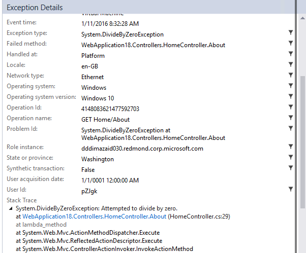
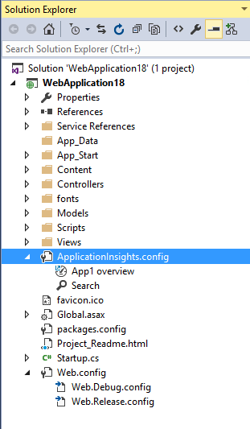
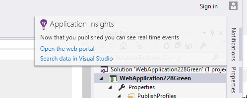

<properties 
	pageTitle="Release notes for Application Insights Logging Adapters" 
	description="The latest updates." 
	services="application-insights" 
    documentationCenter=""
	authors="alancameronwills" 
	manager="douge"/>
<tags 
	ms.service="application-insights" 
	ms.workload="tbd" 
	ms.tgt_pltfrm="ibiza" 
	ms.devlang="na" 
	ms.topic="article" 
	ms.date="12/21/2015" 
	ms.author="abaranch"/>
 
# Release Notes for Application Insights Tools for Visual Studio v4.1

##Version 4.1
### Jump from an exception to method in source code
Now users viewing Exceptions from their Production apps in Application Insights Search window can jump to the method in their code where the Exception is happening. You just need to have the right project loaded and we'll take care of the rest! (To learn more about Search window look at 4.0 release notes below)

#### How does it work?
When a solution is not open, AI Search can be used without opening a solution.  In that case, the stack trace area will show an info message, and many of the items in the stack trace will appear grayed out.
If file information was available, some items may be links, but the solution info item will still be visible.
Clicking on the hyperlink will take you to the where the selected method is in your code, there might be a difference in the version number, but that feature will come in later releases: jump to the right version of code.

###New entry points to the Search Experience in Solution Explorer 

###Pop-up a toast when publish is complete
A pop-up will appear once the project is published online, so you can view your Application Insights data in production.

## Version 4.0
Update 1 support